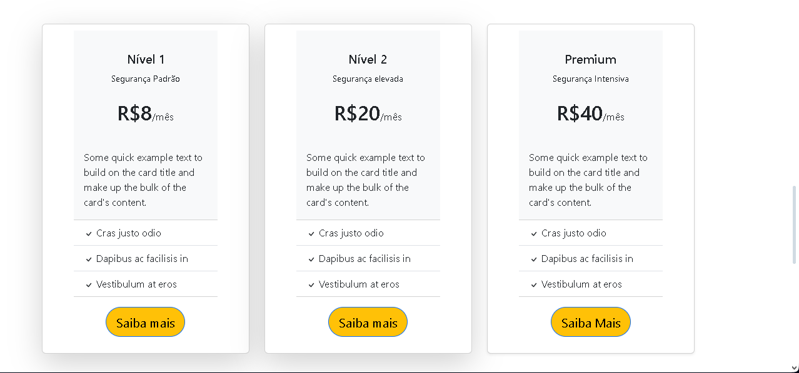
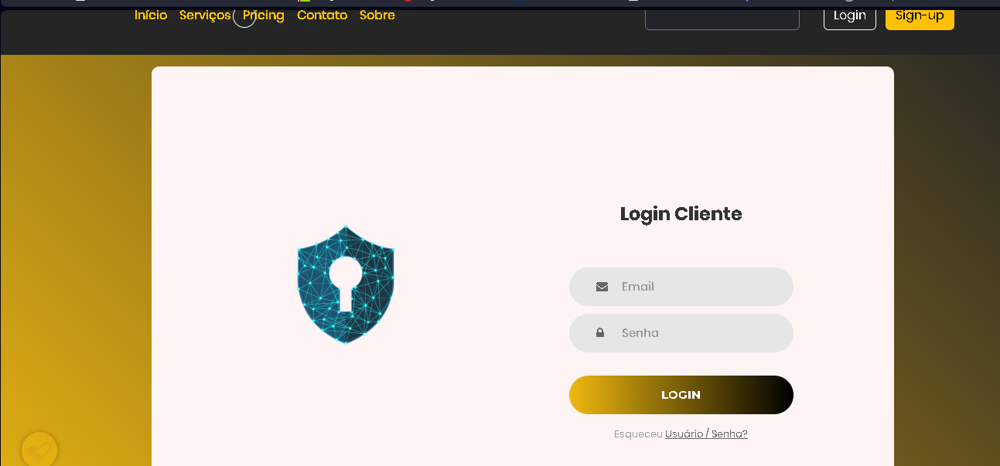

# Securetech
Securetech é uma empresa fictícia criada para ilustrar uma avalição do Curso e Ciência Da computação arquitetada em bootstrap e javascript, foi utilizada também uma biblioteca modificadora de cursor (magicmouse,js)
o site também consta com um script de cookies adopt

### Páginas iniciais do projeto

### Painel de login

